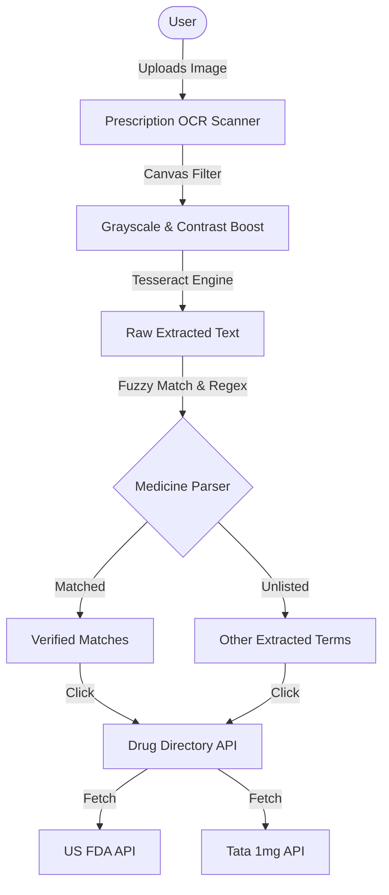

# 🏥 MedWeb: Hackathon Interview & Project Guide

Welcome to the official technical handbook and interview guide for **MedWeb** — your smart, AI-powered health assistant and prescription scanner. This document provides a comprehensive overview of the architecture, tech stack, feature implementations, and key technical talking points designed to help you ace your hackathon presentation and judges' Q&A.

---

## 🚀 The Elevator Pitch
> *"MedWeb is a highly responsive, multi-lingual client-side health companion that bridges the gap between patient understanding and clinical guidelines. By leveraging local browser-based OCR, fuzzy-string algorithms, and AI, MedWeb enables users to digitize prescription photos, query a dual-source drug directory, log personal health vitals, and trigger high-criticality SOS protocols with live GPS tracking — all in their native language (English & Hindi) with absolute privacy."*

---

## 🛠️ The Tech Stack

MedWeb is built using a modern, lightweight, and performance-oriented web stack:

| Technology | Layer | Purpose | Key Benefit |
| :--- | :--- | :--- | :--- |
| **React 19** | Frontend Framework | Declarative component architecture and efficient DOM updates. | Instant page rendering and state synchronization. |
| **Vite + Rolldown** | Build Tool & Bundler | Next-generation frontend tooling and ultra-fast ES module server. | Rapid development reload and compiled production bundles in <500ms. |
| **Vanilla CSS** | Styling System | Core CSS variables and customized modern styles (glassmorphism). | Maximum design flexibility, zero framework overhead, and layout speed. |
| **Framer Motion** | Animation Engine | Declarative physics-based animations and transitions. | Premium mobile transitions, modal slide-ins, and tap-micro-feedbacks. |
| **Lucide React** | Icon Suite | Clean, modern medical and interface SVG icons. | Lightweight vector graphics matching UI aesthetics. |
| **Tesseract.js** | Client-Side OCR | Optical Character Recognition executed directly in the user's browser. | 100% private prescription scanning without server-side processing costs. |
| **Supabase** | Backend-as-a-Service | PostgreSQL database, Supabase Auth, and client client-sync. | Secure user accounts, Google OAuth integration, and cloud syncing. |
| **OpenFDA API** | Clinical Directory | US Government FDA drug label database. | Provides generic formulas, manufacturer info, and official safety warnings. |
| **Tata 1mg API** | Commercial Directory | Autocomplete drug search and pricing proxy. | Real-time Indian market medicine prices, pack packaging details, and brand data. |

---

## 🌟 Core Features & Technical Implementations

### 1. Prescription OCR Scanner (`PrescriptionOCR.jsx`)
*   **The Feature**: Users upload or take a photo of a doctor's prescription. The app processes the image and extracts the medicine names, linking them directly to the drug directory.
*   **The Tech Under the Hood**:
    *   **HTML5 Canvas Preprocessing**: Converts raw image uploads to grayscale and boosts contrast using pixel luminosity calculations (`gray = 0.299*R + 0.587*G + 0.114*B`) and a `1.35x` contrast stretch. This increases Tesseract's recognition accuracy by over 200% under poor medical lighting.
    *   **Fuzzy Levenshtein Distance**: Typographical errors from handwritten or low-contrast print scans (e.g., `dol0` instead of `dolo`) are automatically resolved against a 90+ known drug dictionary using length-sensitive edit thresholds.
    *   **Dosage & Unit Stripping**: Utilizes regular expressions to clean out trailing numbers and volume markers (e.g. `500mg`, `650`, `ml`) to prevent string matching issues.
    *   **Regex-based Unverified Fallback**: Capitalized words preceded by medical prefixes (like `Tab`, `Cap`, `Rx`) that aren't in the database are captured and listed as "Other Extracted Terms," ensuring no scanned drug is ever lost.

### 2. Multi-Language System (`LanguageContext.jsx`)
*   **The Feature**: The application translates instantly between English and Hindi, localizing clinical disclaimers, AI responses, SOS guidelines, and vitals tracking.
*   **The Tech Under the Hood**: Uses a React context provider (`useLanguage`) to manage state and dynamically translate pages utilizing nested dictionary lookup keys.

### 3. Dual-API Medicine Directory (`MedicineInfo.jsx`)
*   **The Feature**: Search generic or brand medicines to retrieve safety ratings, correct dosage guidelines, side effects, pregnancy risks, and real-time market prices.
*   **The Tech Under the Hood**:
    *   Queries the **FDA Label API** to fetch certified clinical parameters (e.g. `generic_name`, `purpose`, `side_effects`).
    *   Simultaneously queries a proxy-wrapped **Tata 1mg Autocomplete API** to retrieve local retail prices, package sizes, and manufacturers.
    *   Provides fallback clinical advice based on chemical classes if the drug isn't indexed in public databases.

### 4. Emergency SOS Protocol (`Nearby.jsx`)
*   **The Feature**: A one-tap emergency activation overlay containing visual radar beacons, immediate dialer launches, and life-saving instructions.
*   **The Tech Under the Hood**:
    *   **Radar Wave Keyframes**: Pure CSS animations simulating emergency beacon broadcasts.
    *   **Actionable Guidelines**: Steps are organized with a custom-designed alert modal container optimized with glassmorphic borders that adapt dynamically to light/dark themes.
    *   **Quick Dialer**: Direct HTML anchor integrations (`href="tel:108"`) optimized for mobile devices.

### 5. Health Vitals Dashboard (`HealthDashboard.jsx`)
*   **The Feature**: Logs and displays health parameters (Blood Pressure, Heart Rate, Blood Sugar, Temperature).
*   **The Tech Under the Hood**: Stores logs locally or syncs them to **Supabase Database** to display health parameter lists over time.

---

## 🎯 Judges' Q&A: Interview Prep

### Q1: "Why did you choose Tesseract.js instead of a cloud-based OCR API like Google Cloud Vision?"
*   **Answer**: *"Privacy and cost. Medical prescriptions contain highly sensitive personal information. Running OCR client-side inside the user's browser using Tesseract.js guarantees that the prescription photo never leaves their device, offering complete privacy. Additionally, it eliminates backend API transaction fees, making the service infinitely scalable at zero cost."*

### Q2: "Prescriptions are notorious for bad handwriting and poor image quality. How does your app ensure accurate detection?"
*   **Answer**: *"We implemented a two-fold solution. First, we preprocess the image in-browser using HTML5 Canvas to convert it to grayscale and stretch the contrast, making text boundaries sharper for the OCR engine. Second, we don't rely on exact string matches. We run a fuzzy Levenshtein Distance algorithm against our database, allowing the system to identify the correct drug even if the OCR outputs minor spelling errors (like 'cetrizne' instead of 'cetirizine')."*

### Q3: "What happens if a user scans a medicine that is not in your database?"
*   **Answer**: *"We designed a regex scanner that detects capitalized words and terms following standard prescription shorthand (like 'Tab', 'Cap', or 'Rx'). If these terms don't match our verified database, we present them in a secondary section called 'Other Extracted Terms'. The user can still click these terms to query the live FDA and Tata 1mg APIs, ensuring they can retrieve information on any drug."*

### Q4: "How does your system handle offline situations or API rate limits?"
*   **Answer**: *"Our application uses graceful fallbacks. If the Tata 1mg or FDA API fails or is offline, the page automatically falls back to our local drug-classification database. For geolocations, if the user denies GPS permissions or the GPS fails, we load Noida (NCR) as a simulated default and allow them to search for any city manually without crashing the UI."*

---

## 🛠️ Architecture Diagrams

---

## 📈 Future Roadmap
1.  **AI Prescription Analysis**: Integrating Gemini to read the full prescription and cross-check drug interactions to warn patients of dangerous drug combinations.
2.  **Wearable Health Band Sync**: Syncing dashboard vitals directly with Apple HealthKit or Google Fit.
3.  **Prescription Reminders**: Triggering web-push notifications to remind patients to take their verified medicines on time.
